# ai-database-2026

AI 에이전트 개발자 데이터베이스 리포지토리

`: 소스 코드나 단어를 표시, **: 글자 bold

## 1일차

```
https://github.com/hugoMGSung/ai-database-2026
```

### PostgreSQL 개요

데이터베이스. 데이터를 한 군데에서 관리하는 목적의 시스템

줄여서 Postgre, Postgres 라고 통칭. **관계형** 데이터베이스.

`SQL`을 통해서 데이터를 **저장, 수정, 삭제, 조회**할 수 있는 시스템

- 기타 관계형 데이터베이스
  - Oracle
  - MySQL / MariaDB
  - SQL Server(from. Microsoft)

위 대부분 상용 소프트웨어, Postgre는 **오픈소스 시스템** 라이선스 비용 X

### DB의 특징

- 데이터 무결성: 데이터가 한 번 들어오면 변동이 없어야 함.
- 데이터 안정성: 한 번 들어온 데이터는 영구적으로 보관됨.
- 데이터 동시성: 한꺼번에 여러 사람이 동시에 쓸 수 있음.
- 표준 SQL 지원
- 확장성
- 대소문자 구분 안함.

### PostgreSQL 설치

#### 기본 설치

- 자신의 OS에 직접 설치하는 방법
- postgresql-18.6-3-windows-x64.exe
- superuser 아이디 - postgres 패스워드 지정
- **port 5432** 기억하기

### DBeaver 설치

- GUI DB관리 실행 툴
- 설치 생략

### DB 접속

1. DBeaver 실행

   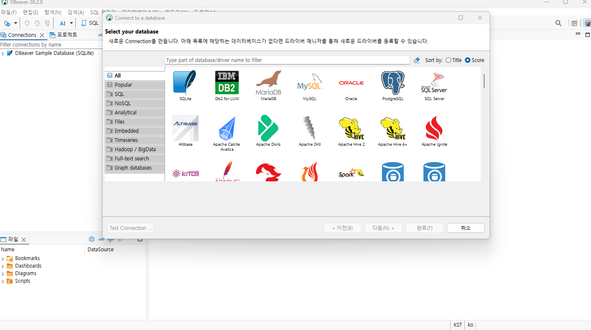
2. 새 DB 연결
3. 데이터 베이스 설정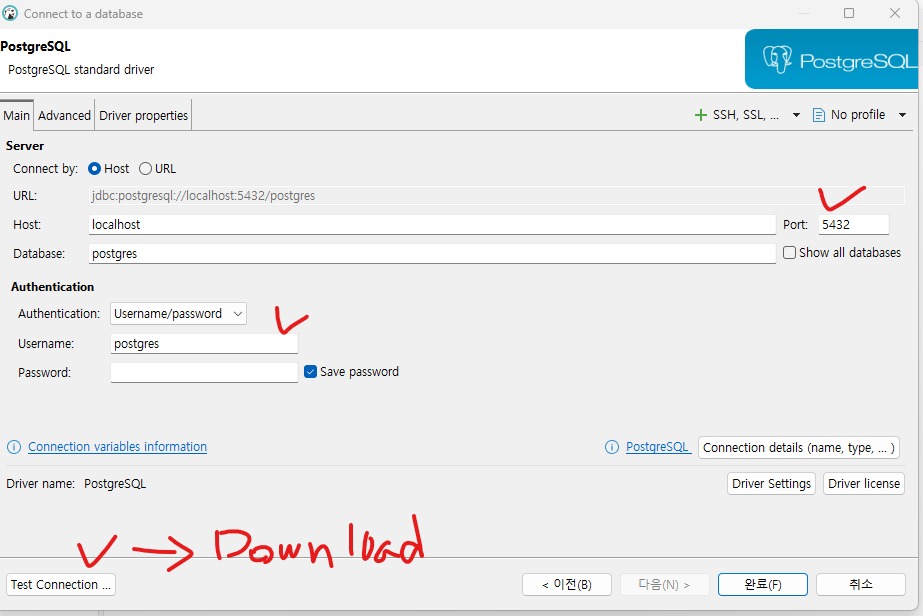
4. test connection 클릭 후 다운 받기
5.
6. 확인 후 완료
7.

### Docker 개요

가상 컨테이너 시스템(도커 내에서 모든 걸 설치할 수 있음. 예로 다른 운영체제에서 ~ 때문에 설치 못함. 해결)

윈도우에서 xCode는 힘들 수 있다고 말씀하심. ios 앱 개발자는 다 맥 보유.

- 환경 의존성 문제를 해결한 컨테이너 기술 솔루션
- **가상환경** 상 여러가지 프로그램 실행하게 만들어줌.
- 컨테이너 - OS, 라이브러리, 설정 등 하나의 패키지로 만들어진 이미지
- 기본 Docker 실행파일 -> Docker Desktop 윈도우에서 Docker를 편하게 사용하도록

### DBeaver Community

백엔드 서버는 보이지 않기 때문에 보면서 작업할 수 있게 해줌.

### Docker Desktop 설치

- https://docs.docker.com/desktop/setup/install/windows-install/
- 윈도우 버전으로 다운로드 후 설치
- Close and Restart 이후
- WSL(Windows Subsystem for Linux) 추가 설치(파워쉘 관리자 권한 열기 -> wsl --install)

### PostgreSQL 이미지 다운로드

- 이미지: Docker repository 에 미리 만들어놓은 시스템 패키지 (1. 먼저)
- 컨테이너: 나의 Docker 에서 미리 다운 받은 이미지를 동작시킨 시스템 (2. 다음)

#### Docker 기본 명령어

```bash
docker --version
```

- 설치된 도커 확인

#### Docker 에서 PostgreSQL 이미지 다운로드

```bash
docker pull postgres, or docker pull postgres:latest
```

- Docker Desktop 전체 검색에서 pull(다운로드)

### 컨테이너 실행

#### 도커 명령어로 실행

- 여러 옵션으로 실행을 해야하므로 거의 대부분 명령어로 실행

```bash
docker run --name my-postgres -e POSTGRES_PASSWORD=123456 -p 25432:5432 -d postgres:latest
```

- -p는 포트를 의미하는데 ' : ' 앞부분은 윈도우 포트(도커에서 호출할 때 쓰는 포트), 뒷부분은 도커 내부에서 돌아가는 포트다. 앞부분 포트는 내가 이미 윈도우에서 쓰고있는 것을 쓰면 안됨.

  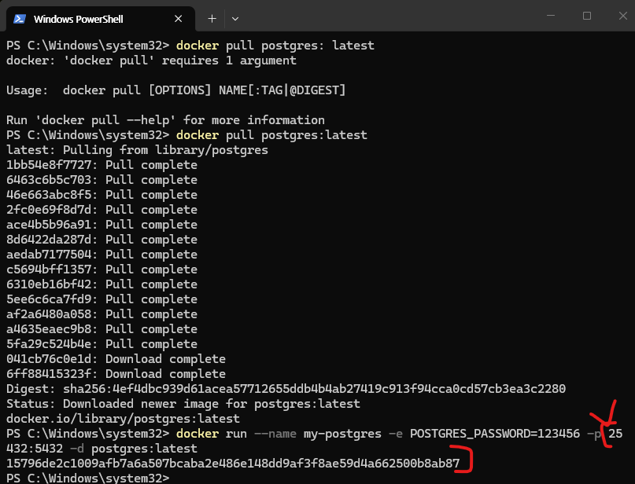
- 체크한 것이 할당된 컨테이너의 아이디

#### DBeaver에서 접속

### DB 기본 사용법

#### PostgreSQL 기본 구조

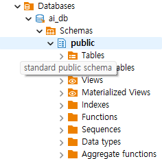

- ai_db - 데이터베이스(프로젝트 전체 공간)
- Schemas - 프로젝트 폴더
- Tables - 실제 데이터를 담는 표

#### DB 생성

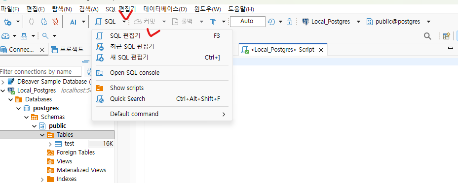

- SQL 편집기 클릭
- 새 이름으로 저장, 특정 이름명.sql로 저장
- ai_db 명칭의 새 데이터베이스 생성

```sql
create database ai_db;
```

- Ctrl + Enter 로 쿼리를 실행
- DB 접속 정보에서 **Show All Databases** 체크하고 재접속

#### 스크립트 생성

- 쿼리를 작성할 스크립트 생성
- SQL편집기(F3) -> New Script -> 파일 -> 다른 이름으로 저장 -> 저장할 위치 지정

#### 테이블 생성

- 아래의 코드 작성

```sql
-- 테이블 생성, 아까 creat table 창 열고 마우스로 설정하는 것을 손코딩
create table students(
	id int generated always as identity primary key, -- 학생 구분값 자동증가
	name varchar(50) not null, -- 이름 
	age int, -- 나이
	email varchar(100), -- 이메일
	created_at timestamp default current_timestamp -- 햔제 작성된 일자 시간
);
```

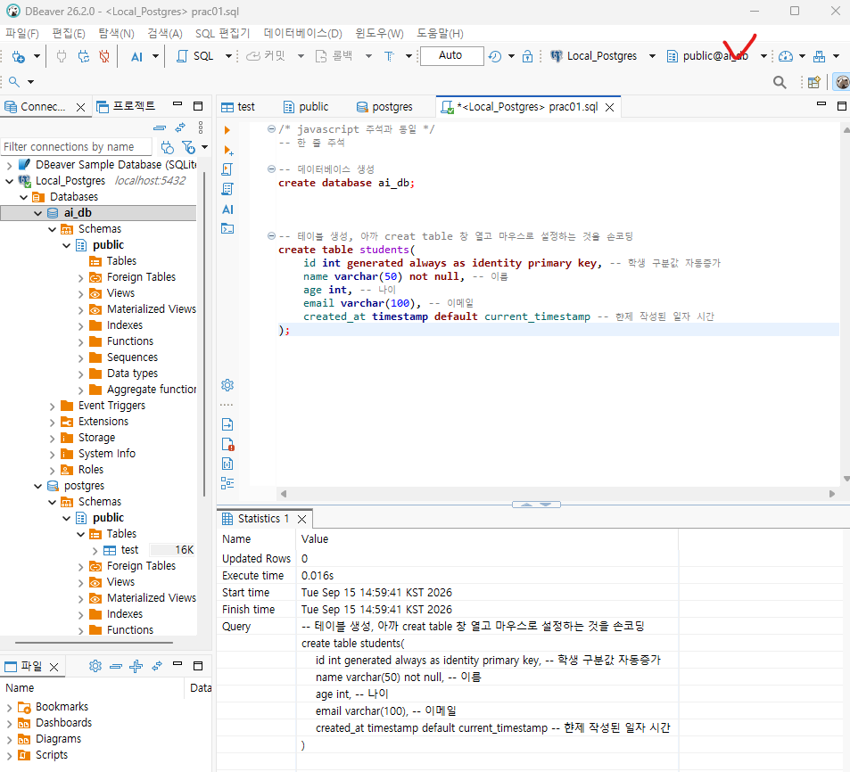

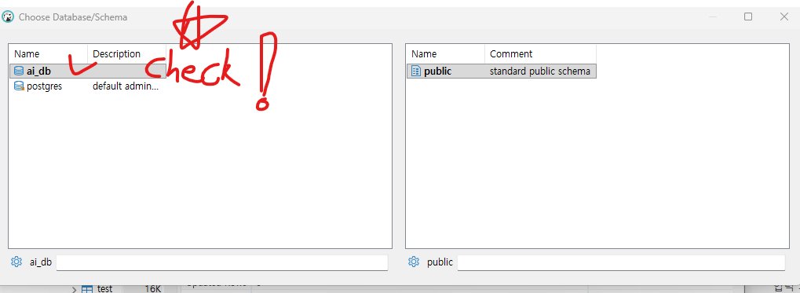

- 데이터 베이스 스키마를 현재 사용할 데이터베이스로 반드시 바꿔줘야 함!!!
- Ctrl + Enter로 확인!

#### 데이터 생성

- insert 쿼리(query: 질의(요청)하다. 데이터베이스에 요청)로 작성

```sql
insert into public.students (name, age, email)
values ('홍길동', 20, 'honggd@gmail.com');

insert into public.students (name, age, email)
values ('김동길', 21, 'kimdg@gmail.com'),
		('장동건', 21, 'qwer@gmail.com'),
		('홍명보', 21, '123@gmail.com'),
		('손흥민', 21, 'asd@gmail.com');
```

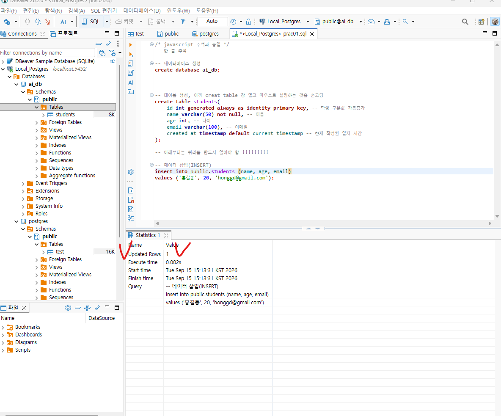

바꾸고 Updated Rows 확인! 1이면 1건이 영향을 받았다.

- select 쿼리 작성 - 난이도가 올라감

```sql
-- 데이터 확인(SELECT)
select * from public.students;
```

- update 쿼리

```sql
-- 데이터 수정(UPDATE)
update students set
		email = 'hong@kakao.com'
where id = 1;
```

- delete 쿼리

```sql
-- 데이터 삭제(DELETE) (데이터 베이스는 '==' 쓰지 않음)
delete from students
	where name = '홍길동';
```

CRUD(★★★★★ 실무에서 아주 많이 씀) - Create, Read, Update, Delere 의 약자

- C - INSERT
- R - SELECT
- U - UPDATE
- D - DELETE

#### PostgreSQL 기본타입


| 데이터 타입 | 설명                          | 예제                       |
| ----------- | ----------------------------- | -------------------------- |
| INT         | 정수                          | 10, 25, -9                 |
| BIGINT      | 큰 정수                       | 10000000000000000000000000 |
| NUMERIC     | 정확한 소수                   | 120000.52                  |
| VARCHAR(n)  | 길이 제한 문자열(4000자 이하) | '홍길동'                   |
| TEXT        | 긴 문자열(1G)                 | 뉴스 게시물 본문           |
| BOOLEAN     | 참 또는 거짓                  | True, False                |
| DATE        | 날짜                          | 2026-09-15                 |
| TIMESTAMP   | 일자(날짜와 시간)             | 2026-09-15 16:00:20.456    |
| JSONB       | JSON 데이터                   | {"name" : "홍길동"}        |

## 2일차

### SQL 기본

데이터베이스 내용에서 가장 기본적인 문법 CRUD

- SQL : Structured Query Language(구조화된 질의 언어)
- 쿼리로 통칭

##### CRUD 정의

데이터 **처리의 기본 동작** 네 가지


| col1       | col2              | col3     |
| ---------- | ----------------- | -------- |
| **CREATE** | 데이터 생성(삽입) | `INSERT` |
| **READ**   | 데이터 읽기(조회) | `SELECT` |
| **UPDATE** | 데이터 수정(변경) | `UPDATE` |
| **DELETE** | 데이터 삭제       | `DELETE` |

- 학생 관리 프로그램을 만든다고 가정,
  - 학생을 등록
  - 학생 목록 조회 / 특정 학생 내용 조회
  - 학생 정보 수정
  - 학생 정보 삭제

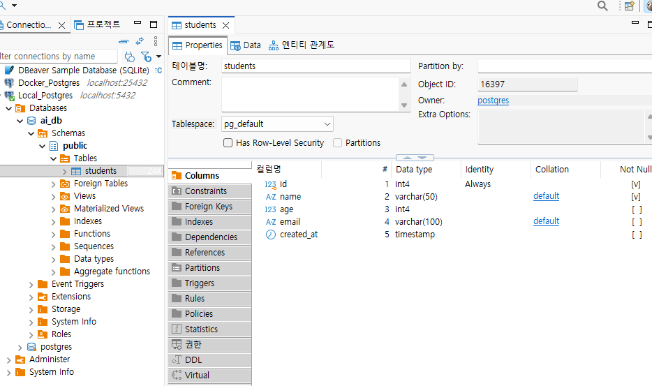

- Properties:
- Data:
- 엔티티 관계도:

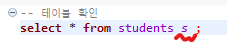

- 뒤에 나온 s는 students가 너무 기니 s로 쓰라는 별명.(s. 으로 사용 ex: s. name)
- ' * ' = all 이란 뜻으로, 테이블 내 모든 컬럼과 데이터를 보여주라는 뜻

##### 데이터 생성

- 항상 SELECT 쿼리로 확인.
- INSERT 쿼리로 데이터 추가

```sql
-- 학생 정보 추가 쿼리(데이터 넣을 때는 별명을 잘 안씀)
-- 쿼리문법 문자열 무조건 ' ', 절대 " " 금지
insert into students(name, age, email)
values ('홍길동', 20, 'honggd@gmail.com');

-- 컬럼 순서 변경
insert into students (age, email, name)
values (29, 'gwonmg@gmail.com', '권민준');

insert into students(name, age, email)
values
('홍길순', 20, 'honggs@gmail.com'),
('홍길매', 20, 'honggm@gmail.com'),
('홍길자', 20, 'honggj@gmail.com');
```

##### 데이터 기본 조회

- SELECT 쿼리로 조회(DB 작업시 항상 먼저 적어두고 확인 후 작업) － [소스](./Day02/prac02.sql)
- 변경 사항이 없기 때문에 select는 Statistics가 안 나옴, 나머진 무조건 Updated Rows: 숫자 확인!
- 처음에는 간단하지만, 뒤로 갈 수록 어려워지는 쿼리

```sql
-- 전체 데이터 조회
select * from students s ;

-- 특정 컬럼만 조회
select s.age, s.'name' from students s ;

-- 필터링! 필요한 데이터만 조회(난이도 UP)
select * from students s 
where s.age < 25;

-- 나이와 이름 일치 데이터 조회
select * from students s 
where s.age = 20
	and s. name = '홍길동';

-- 문자열에 해당 문자나 문자열이 존재하는 것만 조회

-- LIKE문 ▼
-- ~%: ~ 으로 시작하는 문자 다 출력
select * from students s
where s."name" like '홍%';

-- %~: ~ 으로 끝나는 문자 다 출력
select * from students s
where s."name" like '%순';

-- %~%: 이름 중간에 ~ 들어가는 문자 다 출력
select * from students s
where s."name" like '%민%';

-- 홍으로 시작하는데 글자 길이가 5자인 사람, 언더바로 글자 길이 제한. %는 필요 X 
select * from students s
where s."name" like '홍____';
```

- 정렬(`order by`)
  - `ASC`ending: 오름차순
  - `DESC`cending: 내림차순

```SQL
-- Order by 정렬(order by: ~ 방식으로 정렬하다)
select * from students s
	order by "name" desc;

select * from students s
	order by age asc;

-- 나이는 오름차순, 이름은 내림차순으로 정렬
select * from students s
	order by age asc, "name" desc;
```

- 제한
  - limit(필요 개수 만큼만 제한하여 조회)

```SQL
-- 조회수 제한
select * from students s
	order by id desc limit 3;
```

##### 데이터 수정

- UPDATE 쿼리로 수정
- UPDATE 쿼리 실행 시 WHERE 절 없이 실행 주의!!!
  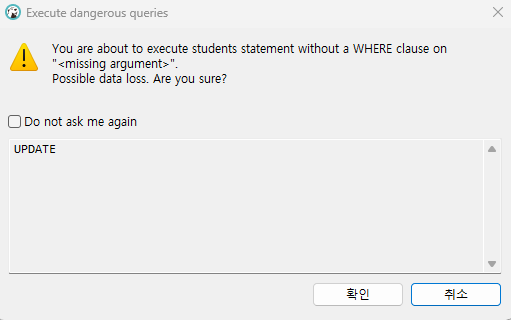

```sql
-- 홍길순의 나이를 변경(where 없이 하면 다 age 60으로 바뀜)
update students s set
	age = 60
where name = '홍길순';

-- 이러지마세요
update students s set
	age = 60;
```

##### 데이터 삭제

- DELETE 쿼리로 삭제
- 최근 회사들은 DELETE를 잘 넣지 않고, DELETE에 True, False를 걸어두고 실제 회원가입시 DELETE: True, 계속 이용중일시 DELETE: False
- DELETE 쿼리 실행 시 WHERE 절 없이 실행 주의!!!

  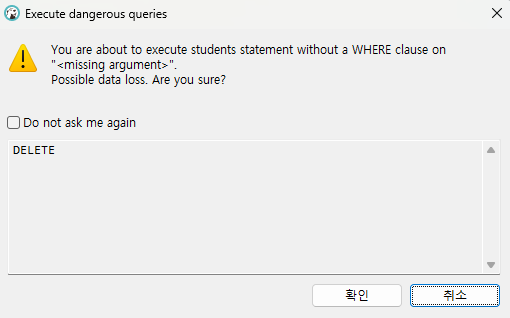

```sql
-- id 7번 삭제
delete from students 
	where id = 7;

-- 이러지마세요
delete from students
```

###### 테이블 완전 초기화

- 데이터 모두 삭제(다른 데이터 베이스에서는 truncate하면 1부터 시작 Postgres는 이전 숫자 사용 x)
- TRUNCATE 로 실행

```sql
truncate students;
```

##### 테이블 삭제

- DELETE는 데이터 삭제, DROP은 테이블 자체 통으로 삭제

  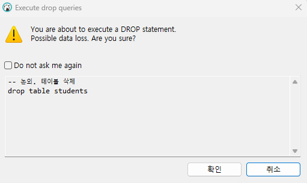

#### NULL

- NULL : 아무값도 들어있지 않다는 것.
- NULL 이라도 추후에 값을 넣을 때 INSERT가 아니라 UPDATE로 넣어줘야함.
- NULL값은 아무것도 못함. 계산 X, 통계 X
- 실무에서: EX) 가입시 선택사항의 경우 선택을 안 하는 사람 -> DB에서 NULL값
- 값이 없다는 뜻. 숫자 0이나 빈 문자열('', "")과 다른 의미
- '' : 문자열은 있는데 안에 아무것도 없음
- ' ' : 문자열 내 공백이라는 값이 있음
- 0 : 0 이라는 숫자 값

#### 테이블 생성(null)

테이블 생성 쿼리

```SQL
creat table students (
	id INT GENERATED ALWAYS AS IDENTITY PRIMARY KEY, -- 기본키(PK) - 중복 안되고 NOT NULL ★★★★★
	name VARCHAR(50) NOT NULL, -- 이름은 NULL이 될 수 없다. (이름은 중복이 가능해서 PK 불가)
	age INT, -- 나이 NULL
	email VARCHAR(100), -- 이메일 NULL
	major VARCHAR(50), -- 전공 NULL
	created_at TIMESTAMP DEFAULT CURRENT_TIMESTAMP -- NULL 
);

insert into students ("name" )
values ('성미나');

insert into students (name, age, email, major)
values (NULL, null, 'seong@gmail.com', null);
```

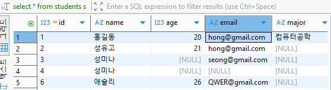

##### NULL 조회 쿼리

- `where 컬럼 is NULL / is not NULL`

#### 테이블 설계

- 일반적으로 DB 설계, 테이블 설계 통칭

#### 필요 개념

- 테이블 설계 - 논리적 테이블 설계, 물리적 테이블 설계
- 컬럼과 데이터 타입 선택
- 기본키(PK) / 외래키(FK) 제약조건
- NOT NULL, UNIQUE, CHECK, 제약조건
- DEFAULT 제약조건
- 테이블 관계

학생과 과목 수강 관리 테이블 설계

##### 테이블 설계?

데이터를 어떤 테이블에 어떤 컬럼에 어떠한 관계를 가지고 저장할지 규정하는 작업

- 학생정보
  - 이름
  - 나이
  - 이메일
  - 전공
  - 수강 과목
  - 담당 강사
  - 수강 신청일
- 엑셀에서는 데이터를 제대로 관리하기 어렵다.

#### 좋은 테이블 설계

- 같은 데이터가 불필요하게 중복되지 않게 한다.
- 한 테이블은 하나의 주제를 가진다.★★★
- 각 행(row)을 구분할 수 있는 기본키(PK)를 가진다.
- 테이블 간의 관계가 외래키(FK)로 연결한다
- 잘못된 데이터가 들어가지 않도록 제약조건을 사용한다.
- 조회, 수정이 이해하기 쉬운 구조여야 한다.

##### 학생 테이블 컬럼 데이터타입 선택


| 구분                 | 설명                           | 데이터타입                                                                             |  |
| -------------------- | ------------------------------ | -------------------------------------------------------------------------------------- | - |
| 학생번호`id`         | 학생을 구분, 반드시 필요       | `INT`(21억까지 가능), BIGINT(경단위: 은행 입출금 내역 및 금융권에서 사용), NUMERIC 중 |  |
| 학생이름`name`       | 문자열로 추가, 반드시 입력     | `VARCHAR(50)`, TEXT(1GB, 문자열) 중                                                    |  |
| 이메일`email`        | 문자열, 선택으로 입력          | `VARCHAR(200)`, TEXT 중                                                                |  |
| 나이`age`            | 숫자, 150살 이하로만 제약      | `INT`...                                                                               |  |
| 전공`magor`          | 문자열 / 실제는 숫자(전공코드) | `VARCHAR(50)`, TEXT / INT...                                                           |  |
| 등록일자`created_at` | 학생 정보를 입력한 일시        | DATE(년, 월, 일),`TIMESTAMP`(년, 월, 일, 시, 분, 초) 중                                |  |

- 정확한 숫자는 numeric(MySQL: decimal), 긴 글은 text, 날짜만 필요하면 date, 참/거짓은 boolean

#### 제약조건 ★★★

##### 1. 기본키

테이블에서 각 행(row) 구분하는 대표값, Primary Key(PK) - **Unique(중복 X) + Not Null**

- 중복 불가!
- 비어있을 수 없다!
- 한 행을 대표
- 다른 테이블에서 참조한다 (EX. PK:1, 이름: 홍길동 / 게시판 저자에 1 적혀있으면 이 테이블에서 참조하여 홍길동이라는 것을 파악)

PostgreSQL 은 `generated always as identity` 숫자 타입의 자동증가, `primary key` 가 기본키를 지정.

```sql
id int generated always as identity primary key
```

MySQL: auto_increment, Oracle: identity 로 문법이 다름.

##### 2. 외래키

다른 테이블의 기본키를 참조하는 컬럼. Foreign Key(FK)

```plaintext
Students
- id : 학생아이디 (PK)
- name : 학생이름

Enrollments(수강)
- id : 수강아이디 (PK)
- students_id : 학생아이디 (FK) / 테이블명_타테이블명 PK (참조)
- course_name : 수강명
```

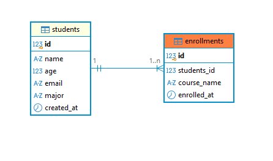
